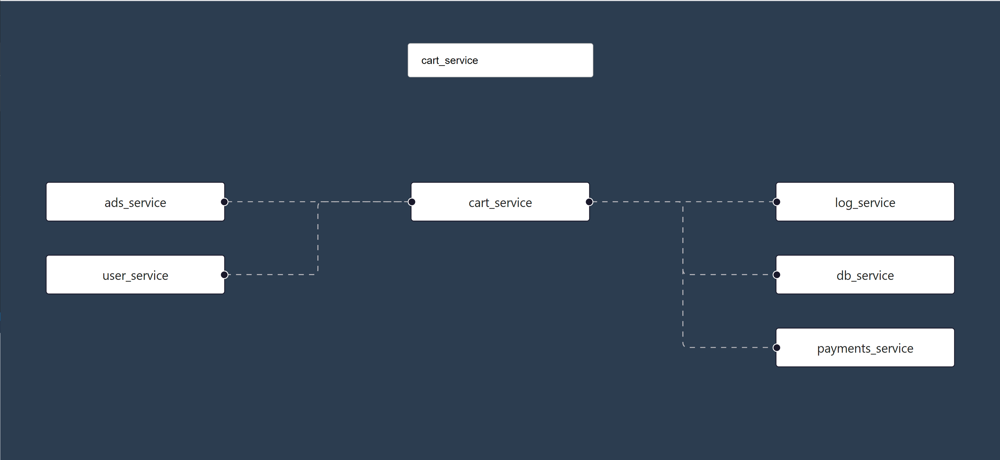

# Full stack exercise

Hi!

The goal in this exercise is to design and develop a basic API server and a React page that presents a flow graph to the user of a microservice environment.

In a microservice environment, microservices send or receive data to each other. In this exercise, we implement a basic flow graph page that shows all network connections between different microservices.

## Your task

In this assignment you will write a basic flow graph page and an API server that serves data to this flow graph page.
The user can then select and "focus" on a microservice he wishes to center on and view its connections.

You can familiarize yourself with the [React web app template](webapp/) we prepared for you:
   - Inside [App.js](webapp/src/App.js) you'll find the template code.
   - The upper Autosuggest component should allow the user to choose a service to "focus" on in the flow graph.
   - After choosing a service, the following should happen:
      - The chosen service appears at the center of the horizontal flow graph.
      - On the left side of the graph, there are all the services sending data to the chosen service.
      - On the right side of the graph, there are all the services receiving data from the chosen service.

Then, you'll have to implement two parts:
1. Implement an API server (GraphQL or REST) that will serve data for the flow graph page.
   - You can use your preferred technology stack and programming language for the API server - preferably Python3 or Nodejs.
   - No need to setup a real database to hold the data flows - an in-memory dict is ok as well.
2. Implement the missing code in the React web app:
   - Add the required code to support service name autocomplete so that also the flow graph focuses on it once entered.
      * Make sure the autocomplete checks in with the BE as theoretically microservices change over time.
   - When clicking on a node on the flow graph - also center that microservice on the flow graph, just like the Autosuggest components focuses on it. 

## Initial repository

We prepared an initial repository that contains the following three directories:

1. [apiserver](apiserver/) - An empty directory, here you should add your server implementation.
2. [events](events/) - Contains events.json file with some communication events.
3. [webapp](webapp/) - A React project we created using React Create App, with a few components you should work with.
   - Use `yarn install` or `npm install` to install dependices; then `yarn start` or `npm start` to run the app

## Submission

1. Clone the initial repository
2. Open a branch for your development
3. After implementing the exercise, open a pull request to the main branch

## Questions

Feel free to reach out and ask any questions, at any time.